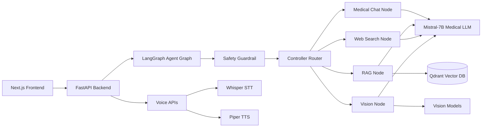

# 🏥 Multi-Agent Medical Assistant

> A production-style AI health platform combining **multi-agent orchestration**, **RAG**, **medical imaging**, **voice interaction**, and **authenticated patient context** — built end-to-end as a full-stack ML engineering showcase.

> ⚠️ **Disclaimer:** For educational and informational use only. Not a substitute for a licensed clinician or medical device.

---

https://github.com/user-attachments/assets/fee62239-e2e7-49ff-a909-ff8996924f2a

## What This Project Demonstrates

| Skill Area | Implementation |
|---|---|
| **AI / ML Engineering** | Multi-agent LangGraph pipeline, fine-tuned Mistral-7B, RAG with Qdrant, PyTorch vision models |
| **Full-Stack Development** | FastAPI backend + Next.js 14 frontend, SSE streaming, JWT auth, async SQLAlchemy |
| **MLOps & DevOps** | Docker Compose, GitHub Actions CI, environment isolation, provider-agnostic LLM config |
| **System Design** | Modular agent nodes, specialist routing, separation of concerns across 10+ services |

---

## Key Features

- **Multi-agent pipeline** — Safety guardrail → intelligent router → specialist nodes (chat, RAG, vision, web search)
- **Medical RAG** — Dense retrieval + BM25 reranking over curated medical PDFs with citation metadata
- **Medical imaging AI** — MobileNetV3 classifiers for Brain MRI, Chest X-ray, and Skin Lesion with Grad-CAM explainability
- **Voice interface** — Whisper STT + Piper TTS for fully spoken medical conversations
- **Patient context** — Age, allergies, medications, and conditions injected into every LLM call
- **Consultation history** — Authenticated users can review past conversations

---

## Architecture



**Agent flow:** Every request passes through a guardrail node, gets routed to the appropriate specialist (chat / RAG / vision / web), and streams a response back to the UI. Authenticated users get responses stored as consultation records.

---

## Tech Stack

**Backend:** FastAPI · LangGraph · Mistral-7B (OpenAI-compatible) · Qdrant · SentenceTransformers · PyTorch · faster-whisper · Piper TTS · SQLAlchemy (async) · JWT

**Frontend:** Next.js 14 · React · TypeScript · Tailwind CSS · Zustand

**DevOps:** Docker Compose · GitHub Actions CI

---

## Vision Modalities

| Modality | Labels | Explainability |
|---|---|---|
| Brain MRI | No Tumor · Glioma · Meningioma · Pituitary | Grad-CAM heatmap |
| Chest X-ray | Normal · Pneumonia | Grad-CAM heatmap |
| Skin Lesion | Benign · Malignant | Grad-CAM heatmap |

Models can run in **mock mode** for development or with trained weights from Kaggle datasets (see `docs/VISION_WEIGHTS.md`).

---

## Quick Start

### Prerequisites
- Python 3.10+ and Node.js 18+
- Docker (for Qdrant)
- An OpenAI-compatible LLM endpoint (Ollama, vLLM, or hosted)

### 1. Start the LLM
```bash
ollama serve
ollama create mistral-7b-medical -f Modelfile
```
> For vLLM or hosted providers, see `docs/LLM_SETUP.md`.

### 2. Backend Setup
```bash
cd Multi_med_agent
pip install -r backend/requirements.txt
cp backend/.env.example backend/.env
```

Edit `backend/.env`:
```env
LLM_BASE_URL=http://localhost:11434/v1
LLM_API_KEY=ollama
LLM_MODEL=mistral-7b-medical
QDRANT_URL=http://localhost:6333
JWT_SECRET=your-strong-secret-here
```

### 3. Start Services & Run
```bash
docker compose up -d          # starts Qdrant
uvicorn app.main:app --reload --host 0.0.0.0 --port 8000
```
API docs → http://localhost:8000/docs

### 4. Frontend
```bash
cd frontend && npm install && npm run dev
```
App → http://localhost:3000

---

## API Reference

| Endpoint | Description |
|---|---|
| `POST /api/chat` | Chat with optional image upload |
| `POST /api/chat/stream` | SSE streaming chat |
| `POST /api/voice/stt` | Speech-to-text (Whisper) |
| `POST /api/voice/tts` | Text-to-speech (Piper) |
| `POST /api/auth/register` | Register a user |
| `POST /api/auth/login` | Login |
| `GET /api/profile` | Patient profile |
| `GET /api/consultations` | Consultation history |
| `GET /api/health` | System health + CUDA info |
| `GET /api/rag/status` | RAG collection readiness |

---

## Environment Variables

| Variable | Required | Description |
|---|---|---|
| `LLM_BASE_URL` | ✅ | OpenAI-compatible inference endpoint |
| `LLM_API_KEY` | ✅ | API key (or `ollama` for local) |
| `LLM_MODEL` | ✅ | Medical Mistral model name |
| `QDRANT_URL` | ✅ | Vector database URL |
| `JWT_SECRET` | ✅ | Auth secret |
| `TAVILY_API_KEY` | ❌ | Optional web search |
| `USE_MOCK_MODELS` | ❌ | Toggle mock vision models |
| `WHISPER_MODEL` | ❌ | STT model size |
| `PIPER_MODEL_PATH` | ❌ | Local TTS model path |

---

## Project Structure

```
Multi_med_agent/
├── backend/app/
│   ├── agents/       # LangGraph nodes: guardrail, router, chat, RAG, web, vision
│   ├── services/     # RAG, vision, voice service layer
│   ├── routers/      # Auth, profile, consultations, voice endpoints
│   ├── core/         # Config, auth, logging, security
│   └── db/           # Async SQLAlchemy models
├── frontend/src/
│   ├── components/   # Chat UI, sidebar, image uploader, source cards
│   ├── hooks/        # Speech and streaming hooks
│   └── store/        # Zustand state management
├── scripts/          # PDF ingestion, model training, env verification
├── docs/             # LLM setup guide, vision weights guide
└── docker-compose.yml
```

---

## Testing

```bash
# Backend
PYTHONPATH=./backend pytest backend/tests -v

# Frontend
cd frontend && npm run build
```

CI runs both on every push via GitHub Actions.

---

## Production Notes

- All secrets managed via `.env` — never committed (`.env.example` provided as template)
- LLM provider is fully swappable via `LLM_*` env vars — works with Ollama, vLLM, or any OpenAI-compatible API
- Medical responses include safety disclaimers and non-diagnostic language throughout
- Heavy model artifacts (weights, datasets, DBs) are gitignored
- Backend and frontend deploy independently
