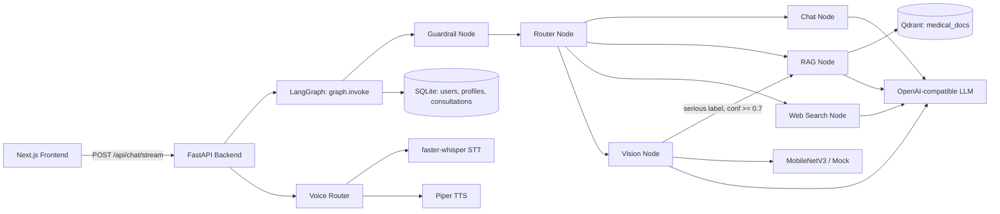

# 🏥 MedOrch — Multi-Agent Medical Assistant

> A full-stack AI portfolio project combining **multi-agent orchestration (LangGraph)**, **retrieval-augmented generation**, **medical image classification**, **voice interaction**, and **authenticated patient context**.

> ⚠️ **Disclaimer:** For educational and portfolio use only. This is **not** a certified medical device, and it is not intended to diagnose, treat, or provide clinical decisions. Vision models run in **mock mode by default** (see below).

---

https://github.com/user-attachments/assets/fee62239-e2e7-49ff-a909-ff8996924f2a

---

## What This Project Demonstrates

| Skill Area | Implementation |
|---|---|
| **AI / ML Engineering** | LangGraph multi-agent pipeline, OpenAI-compatible LLM integration, hybrid RAG (dense + BM25) with Qdrant, MobileNetV3 vision classifiers |
| **Full-Stack Development** | FastAPI backend + Next.js 14 frontend, SSE-based response delivery, JWT auth, async SQLAlchemy |
| **MLOps & Tooling** | Docker Compose (Qdrant), GitHub Actions CI (pytest + frontend build), provider-agnostic LLM config via env vars |
| **System Design** | Stateless graph execution, specialist routing, clear separation between agents, services, and routers |

---

## Key Features

- **Multi-agent pipeline** — a safety guardrail, an intelligent router, and one of four specialist nodes (chat, RAG, vision, web search) handle each request
- **Hybrid medical RAG** — dense retrieval (MiniLM embeddings) + BM25 reranking (Reciprocal Rank Fusion) over PDFs ingested into Qdrant
- **Medical imaging classifiers** — MobileNetV3-Small heads for Brain MRI, Chest X-ray, and Skin Lesion, with Grad-CAM explainability *(real inference path only — see Vision Modalities below)*
- **Voice interface** — local Whisper (STT) and Piper (TTS) for spoken interactions
- **Patient context** — profile fields (age, allergies, medications, conditions) are injected into the LLM prompt as free text
- **Consultation history** — authenticated users have each Q&A saved and retrievable

---

## Architecture


```mermaid
flowchart LR
    UI[Next.js Frontend] -->|POST /api/chat/stream| API[FastAPI Backend]
    API --> Graph[LangGraph: graph.invoke]

    Graph --> Guardrail[Guardrail Node]
    Guardrail --> Router[Router Node]

    Router --> Chat[Chat Node]
    Router --> RAG[RAG Node]
    Router --> Web[Web Search Node]
    Router --> Vision[Vision Node]

    Vision -->|serious label, conf >= 0.7| RAG
    RAG --> Qdrant[(Qdrant: medical_docs)]
    Vision --> VisionModels[MobileNetV3 / Mock]
    Chat --> LLM[OpenAI-compatible LLM]
    RAG --> LLM
    Web --> LLM
    Vision --> LLM

    API --> Voice[Voice Router]
    Voice --> Whisper[faster-whisper STT]
    Voice --> Piper[Piper TTS]

    Graph --> DB[(SQLite: users, profiles, consultations)]
```

**How a request actually flows:**
1. The frontend sends only the **current message** to `/api/chat/stream` — the graph does not receive prior chat history.
2. If the user is authenticated, their profile is serialized to text and added to the prompt.
3. The graph runs synchronously: **guardrail** (keyword/substring match, no model) → **router** (image-present heuristic, or an LLM call returning `{"next_step": ...}`, defaulting to `rag` on parse failure) → one **specialist node** → a pass-through response node that reads the last AI message.
4. **SSE is not token-level streaming.** The full answer is generated first, then split on sentence boundaries and sent one sentence at a time.
5. For authenticated users, the exchange is saved as a single consultation record.

Agent nodes are plain Python functions sharing one `TypedDict` state — not separate microservices.

---

## The Four Specialists

| Node | What it does |
|---|---|
| **Chat** | LLM call with a short "spoken-doctor" system prompt. If the user says they're uploading an image but none is attached, a hardcoded prompt asks them to attach one. |
| **RAG** | Embeds the query (MiniLM) → Qdrant top-20 → BM25 rerank + RRF (k=60) → top 5 chunks → LLM with citations. An empty Qdrant collection falls back to the LLM's general knowledge. |
| **Web** | Tavily search (requires `TAVILY_API_KEY`) → LLM. Without a key, the LLM answers with no search context. |
| **Vision** | Classifies an uploaded image for `brain_mri`, `chest_xray`, or `skin_lesion`. If the result is a "serious" label with confidence ≥ 0.7, the graph also runs the RAG node for supporting context. |

---

## LLM

- The backend uses a single **LangChain `ChatOpenAI`** client pointed at any OpenAI-compatible endpoint (`LLM_BASE_URL`), defaulting to a local Ollama server.
- The default model **name** is `mistral-7b-medical`, but **no fine-tuning code, training data, or weights ship in this repo** — the model is whatever you point the endpoint at.
- Temperature `0.2`, max tokens `1024`.
- If the LLM endpoint is unreachable, nodes return a short error string rather than crashing the whole graph in most cases.

---

## Vision Modalities

| Modality | Labels | Explainability |
|---|---|---|
| Brain MRI | No Tumor · Glioma · Meningioma · Pituitary | Grad-CAM (real inference path only) |
| Chest X-ray | Normal · Pneumonia | Grad-CAM (real inference path only) |
| Skin Lesion | Benign · Malignant | Grad-CAM (real inference path only) |

**Important:** `USE_MOCK_MODELS` defaults to `true`. In mock mode, the image is **ignored entirely** and each modality always returns a fixed result:

- Brain MRI → always `Glioma`, 98%
- Chest X-ray → always `Normal`, 95%
- Skin Lesion → always `Benign`, 92%

To get real inference, train weights with `scripts/train_vision_models.py` (MobileNetV3-Small, Adam 1e-4, 2 epochs by default — no validation split, no cross-validation) and set `USE_MOCK_MODELS=false`. Without trained weights, the real path falls back to an ImageNet-pretrained backbone with a **randomly initialized** classification head, so its outputs are not meaningful either.

---

## Tech Stack

**Backend:** FastAPI · LangGraph · LangChain (`ChatOpenAI`) · Qdrant · sentence-transformers (`all-MiniLM-L6-v2`) · rank-bm25 · PyTorch / torchvision · faster-whisper · Piper TTS · grad-cam · SQLAlchemy (async) + SQLite · python-jose (JWT) · passlib · tavily-python (optional)

**Frontend:** Next.js 14 · React · TypeScript · Tailwind CSS · Zustand · react-markdown

**Infra:** Docker Compose (Qdrant only — the app itself runs via `uvicorn` / `npm run dev`) · GitHub Actions CI (pytest + frontend build)

**Not used**, despite being easy to assume otherwise: TensorFlow, scikit-learn, pandas, scipy, MLflow. `httpx` is listed in `requirements.txt` but unused in code.

---

## Quick Start

### Prerequisites
- Python 3.10+ and Node.js 18+
- Docker (for Qdrant)
- An OpenAI-compatible LLM endpoint (Ollama, vLLM, or a hosted provider)

### 1. Start the LLM
```bash
ollama serve
ollama create mistral-7b-medical -f Modelfile
```
> For vLLM or a hosted provider, point `LLM_BASE_URL` / `LLM_API_KEY` at it instead — see `docs/LLM_SETUP.md`.

### 2. Backend setup
```bash
cd Multi_med_agent
pip install -r backend/requirements.txt
cp backend/.env.example backend/.env
```

Edit `backend/.env`:
```env
LLM_BASE_URL=http://localhost:11434/v1
LLM_API_KEY=ollama
LLM_MODEL=mistral-7b-medical
QDRANT_URL=http://localhost:6333
JWT_SECRET=your-strong-secret-here
USE_MOCK_MODELS=true
```

### 3. Start services and run
```bash
docker compose up -d          # starts Qdrant only
uvicorn app.main:app --reload --host 0.0.0.0 --port 8000
```
API docs → http://localhost:8000/docs

### 4. Frontend
```bash
cd frontend && npm install && npm run dev
```
App → http://localhost:3000

---

## API Reference

| Method | Endpoint | Description |
|---|---|---|
| GET | `/` | Redirects to `/docs` |
| POST | `/api/chat` | Chat with optional image upload |
| POST | `/api/chat/stream` | SSE-delivered chat (sentence-chunked, not token-streamed) |
| POST | `/api/reset` | Clears a largely unused server-side session (chat itself is stateless) |
| POST | `/api/auth/register` | Register a user |
| POST | `/api/auth/login` | Login |
| GET | `/api/auth/me` | Current user from JWT |
| GET / PUT | `/api/profile` | Patient profile |
| GET | `/api/consultations` | Consultation history |
| GET | `/api/consultations/{id}` | Single consultation |
| GET | `/api/voice/status` | Voice model load status |
| POST | `/api/voice/warmup` | Preload STT/TTS models |
| POST | `/api/voice/stt` | Speech-to-text (used by the UI) |
| WS | `/api/voice/stt/stream` | Streaming STT (not currently used by the frontend) |
| POST | `/api/voice/tts` | Text-to-speech, returns WAV |
| POST | `/api/voice/tts/chunks` | Text-to-speech, chunked base64 |
| GET | `/api/health` | System health + CUDA info |
| GET | `/api/rag/status` | Qdrant collection point count |

---

## Environment Variables

| Variable | Required | Description |
|---|---|---|
| `LLM_BASE_URL` | ✅ | OpenAI-compatible inference endpoint |
| `LLM_API_KEY` | ✅ | API key (or `ollama` / `not-needed` for local) |
| `LLM_MODEL` | ✅ | Model name sent to the endpoint |
| `QDRANT_URL` | ✅ | Vector database URL |
| `JWT_SECRET` | ✅ | Auth signing secret |
| `TAVILY_API_KEY` | ❌ | Enables the web-search node |
| `USE_MOCK_MODELS` | ❌ | Defaults to `true` — see Vision Modalities |
| `WHISPER_MODEL` | ❌ | STT model size (default `base.en`) |
| `PIPER_MODEL_PATH` | ❌ | Local TTS voice model path |

---

## Project Structure

```
Multi_med_agent/
├── backend/app/
│   ├── agents/       # LangGraph nodes: guardrail, router, chat, rag, web, vision, graph.py
│   ├── services/
│   │   ├── rag/      # embedder.py, retriever.py (dense + BM25 + RRF), qdrant_client.py
│   │   ├── vision/   # brain_mri / chest_xray / skin_lesion runners + mocks, gradcam_utils.py
│   │   └── voice/    # stt_service.py, tts_service.py
│   ├── routers/      # auth, profile, consultations, voice
│   ├── core/         # config, auth, logging, security (placeholder)
│   └── db/           # async SQLAlchemy models (User, Profile, Consultation)
├── frontend/src/
│   ├── components/   # chat UI, sidebar, image uploader, InsightsPanel (source cards)
│   ├── hooks/        # useSpeech.ts, useStreamingSTT.ts
│   └── store/        # Zustand state
├── scripts/          # ingest_pdfs.py, train_vision_models.py, download_vision_weights.py, verify_env.py
├── docs/             # PDF drop zone + LLM/vision/docker setup guides
└── docker-compose.yml   # starts Qdrant only
```

**Not in the repo:** trained model weights (gitignored), Jupyter notebooks, EEG/signal-processing code, drug-embedding (ChemBERTa/SMILES) code, a `models/` fine-tune, or a backend Dockerfile.

---

## Testing

```bash
# Backend
PYTHONPATH=./backend pytest backend/tests -v

# Frontend
cd frontend && npm run build
```

CI runs both on every push via GitHub Actions.

---

## Known Limitations

Being upfront about these matters more than hiding them — especially in interviews:

- **Vision is mock-by-default.** Without trained weights and `USE_MOCK_MODELS=false`, image classification ignores the actual image content.
- **No fine-tuned LLM ships in this repo.** The medical LLM is any OpenAI-compatible endpoint you connect; there's no training code or weights for it here.
- **Chat is stateless server-side.** Multi-turn memory isn't implemented in the graph — only the current message is sent per request (though past consultations are saved and viewable separately).
- **Guardrail is keyword matching**, not a trained safety classifier.
- **SSE is not real token streaming** — the response is generated in full, then split into sentences for delivery.
- **`docker-compose.yml` only starts Qdrant** — the API and frontend run manually, not containerized.
- **CORS is wide open (`*`)** and no rate limiting exists — this is a demo configuration, not production-hardened.
- Confirm `backend/app/models/schemas.py` exists in your checkout before running — it's imported throughout the backend, and in one review it was found missing from the workspace.

---

## Production Notes

- Secrets are managed via `.env`, never committed (`.env.example` is the template)
- The LLM provider is fully swappable via `LLM_*` env vars — works with Ollama, vLLM, or any OpenAI-compatible API
- Medical responses include safety disclaimers and non-diagnostic language in the system prompts
- Heavy model artifacts (weights, datasets, the SQLite DB) are gitignored
- Backend and frontend can be deployed independently
